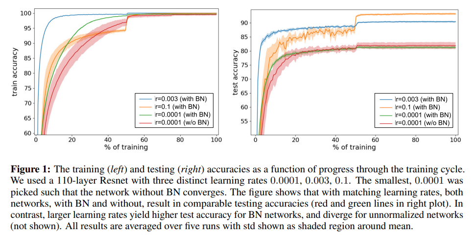
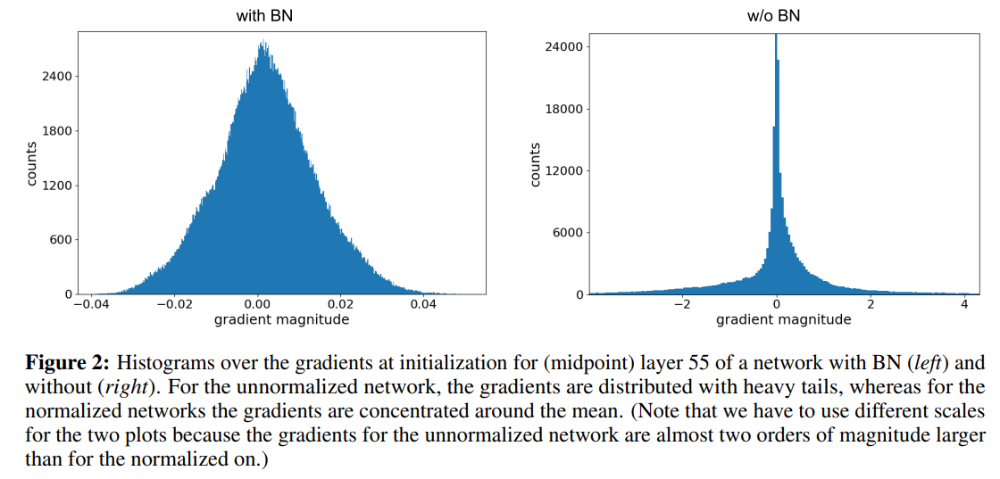
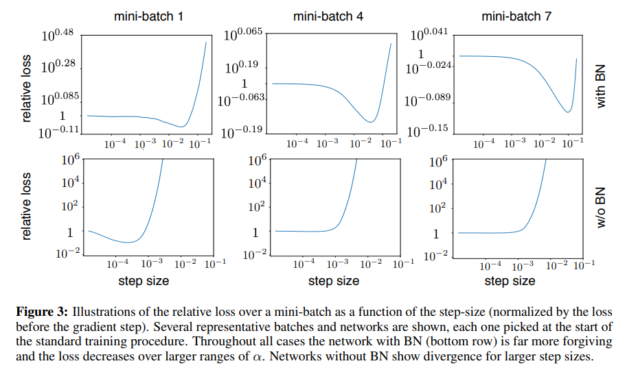

## The Batch Normalization Algorithm
Both the input and the output of a BN layer are four dimensional tensors. Call them $ I_{b,c,x,y}$ and $ O_{b,c,x,y}$. BN applies the same normalization for all activations in a given channel.

$$ O_{b,c,x,y} \leftarrow \gamma_c \frac{I_{b,c,x,y}-\mu_c}{\sqrt{\sigma_c^2+\epsilon}}+\beta_c\quad \forall\, b,c,x,y$$
Here
$$ \mu_c = \dfrac{1}{|\mathcal{B}|}\sum_{b,x,y}I_{b,c,x,y}$$
where
$ \mathcal{B}$ contains all activations in channel $ c$ across all feature $ b$ in the entire mini-batch and all spatial $ x,y$ locations.
During testing, running averages of the mean and variances are used. Normalization is follow by a channel-wise affine transformation parameterised through $ \gamma_c, \beta_c$ which are learned during training.

## Why use running averages during inference?
Each mini-batch normalization would happen based only on that mini-batch's own statistics.
The idea of using running averages comes from the fact that we get a better estimate of the true mean and variance compared to individual mini-batches.

### Why can't we use running average during training
During training the batch-propagation needs to go through the batch statistics as well. If a running-average is used then we need to account for the activations from previous mini-batches.

# Disentangling the benefits of BN
[This paper](https://arxiv.org/pdf/1806.02375.pdf) provides evidence that batch normalization enables the use of higher learning rates which mediates the majority of its benefits.
The authors train the ResNet model without batch normalization with a learning rate of $ 0.0001$ . The model requires 2400 epochs for convergence. They then train the ResNet model now with batch normalization with a learning rate of $ 0.003$ which requires 1320 epochs for convergence. They also train this model with a learning rate of $ 0.0001$ and it performs no better than the unnormalized network. They also train the two models with a learning rate of $ 0.1$. The unnormalized network shows a large difference in train and test accuracy, indicating more overfitting.

## Learning rate and generalization
The gradient step for SGD is
$$\displaystyle\alpha\nabla_{SGD}(x) = \frac{\alpha}{|B|} \sum_{i\in B}\nabla l_i(x)$$
Subtract and add $\alpha\nabla l(x)$
$$\displaystyle\alpha\nabla_{SGD}(x) = {\alpha\nabla l(x)} + {\frac{\alpha}{|B|} \sum_{i\in B}(\nabla l_i(x) - \nabla l(x))}$$
The gradient estimate is unbiased because
$$\mathbb{E}\left[\frac{\alpha}{|B|} \sum_{i\in B}(\nabla l_i(x) - \nabla l(x))\right] = 0$$
However, the gradient estimate will be noisy. Define a noisy quantity C of a single gradient estimate such that $ C=\mathbb{E}\left[\|{\nabla l_i(x) - \nabla l(x)}\|^2\right]$
We will try to find an upper bound for the noise term in terms of $ C$ and mini-batch size $ B$ and the learning rate $ \alpha$.


$$
\begin{align}
\mathbb{E}\left[\left\|\frac{1}{|B|} \sum_{i\in B}(\nabla l_i(x) - \nabla l(x))\right\|^2\right] \label{eq:main}
\end{align}
$$


Define $ \Delta_i = \nabla l_i(x)-\nabla l(x)$ , and take $ \gamma_i$ to be an indicator variable equal to one if example i is in batch B and zero otherwise.
\eqref{eq:main}
$$ (1) = \frac{1}{|B|^2} \mathbb{E}\left[\sum_{i=1}^N\sum_{j=1}^N\gamma_i\gamma_j\Delta_i^T\Delta_j\right]$$
Let us defined $ b=|B|$. Since samples are drawn independently we have


$$
\begin{align}
\mathbb{E}[\gamma_i\gamma_i] &= \frac{b}{N} \\
\mathbb{E}[\gamma_i\gamma_j] &= \frac{b^2}{N^2}
\end{align}
$$



$$
\begin{align}
(1) &= \frac{1}{b^2}\mathbb{E}\left[\frac{b^2}{N^2}\sum_{i\neq j}\Delta_I^T\Delta_j + \frac{b}{N}\sum_{i=1}^{N}\|\Delta_i\|^2\right] \\
&= \frac{1}{bN}\mathbb{E}\left[\frac{b}{N}\sum_{i,j}\Delta_i^T\Delta_j+\left(1-\frac{b}{N}\right)\sum_{i=1}^N\|\Delta_i\|^2\right]
\end{align}
$$


Since the gradient estimate is unbiased, the first term vanishes.

$$
\begin{align}
(1) = \frac{N-b}{bN^2}\mathbb{E}\left[\sum_{i=1}^N\|\Delta_i\|^2\right] = \frac{N-b}{bN}\mathbb{E}\left[\frac{1}{N}\sum_{i=1}^N\|\Delta_i\|^2\right] \leq \frac{C}{b}
\end{align}
$$


So, we can upper-bond the noise of the gradient step estimate given by SGD as
	$$
\mathbb{E}\left[\left\|\alpha\nabla l(x)-\alpha\nabla_{SGD}(x)\right\|^2\right]\leq\frac{\alpha^2}{|B|}C
$$
Depending on the tightness of this bound, it suggests that the noise should reduce is the mini-batch size is increased.

# Batch Normalization and Divergence
The authors compared the gradients between batch normalized and unnormalized networks in the initial epochs, they found that the gradients of comparable parameters are larger and distributed with heavier trails in the unnormalized networks.

Further, the authors define network divergence as the point when the loss of a mini-batch increases beyond $10^3$ (a point from which networks have never managed to recover to acceptable accuracies in their experiments)

The authors infer from these experiments that batch-normalization enables the use of higher learning rate.
To further demonstrate unstable nature of unnormalized networks, the authors show the means and variance of channels in three layers (8, 44, 80) on the unnormalized network during an update which causes the loss to shoot up a lot.

# Resources used for writing this blog
1. https://arxiv.org/pdf/1806.02375.pdf
2. https://stackoverflow.com/questions/60460338/does-batchnormalization-use-moving-average-across-batches-or-only-per-batch-and

# Potential topics to follow
1. batch renormalization
2. group normalization
3. layer normalization